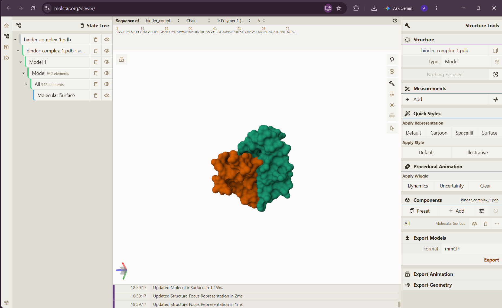

# Computational Binder Design Against Alpha-Bungarotoxin

A proof-of-concept protein binder design pipeline targeting **alpha-bungarotoxin** (PDB [2ABX](https://www.rcsb.org/structure/2ABX)), a neurotoxin from *Bungarus multicinctus* (many-banded krait) venom that blocks nicotinic acetylcholine receptors. This project uses generative protein design tools to design a novel 60-residue binder that engages the toxin's receptor-binding interface.

**This is a computational-only learning/portfolio project — not a synthesized, tested, or validated antidote.** See [Limitations](#limitations--scope) below.

## What this does

The pipeline:
1. Fetches the real 2ABX crystal structure from RCSB PDB
2. Defines the toxin's receptor-binding hotspot residues (A36, A38, A39, A40) — the residues known to contact the acetylcholine receptor
3. Uses **RFdiffusion** to generate novel binder backbones (40–80 residues) targeting that hotspot
4. Uses **ProteinMPNN** to design sequences for each backbone
5. Filters candidates using **AlphaFold2-Multimer (binder mode)**, scoring interface confidence (ipTM) and structural confidence (pLDDT)
6. Selects the top-scoring candidates

Built on [Proto](https://github.com/evo-design/proto-language) (a design-language framework from the Arc Institute / Brian Hie's group) wrapping RFdiffusion, ProteinMPNN, and AlphaFold2.

## Method

| Component | Tool |
|---|---|
| Target structure | 2ABX (RCSB PDB) |
| Backbone generation | RFdiffusion |
| Sequence design | ProteinMPNN |
| Structure-based filtering | AlphaFold2-Multimer (binder config) |
| Constraints | interface pTM (ipTM), pLDDT, length (40–80 aa) |
| Framework | Proto (`proto-language`) |

## Best candidate

```
Sequence: KTYEDCSLYKSKEGCEEAKKICEEVANDPNVKGKGSGELVIDESECDGPCKFKCEVEKKG
Length:   60 residues
ipTM:     0.912
pLDDT:    0.554
```

Structure file: [`best_binder_candidate.cif`](./best_binder_candidate.cif)
Full candidate pool: [`binder_candidates_batch2.csv`](./binder_candidates_batch2.csv)


*Molecular surface view of the designed complex (Mol\* Viewer). Orange = designed 60-residue binder; teal = alpha-bungarotoxin. The two chains form a continuous, non-clashing interface — confirmed independently via inter-chain atomic distance (see Validation methodology below).*

## Validation methodology

A single confidence metric wasn't enough to trust on its own. Early in this project, a candidate with a similarly high ipTM (~0.90) turned out, on visual inspection, to not actually be in contact with the target — the score alone was misleading.

To catch this, the pipeline validates candidates on two dimensions:
- **AF2 confidence scores** (ipTM for interface quality, pLDDT for structural confidence) — filters that reward likely folded, well-docked complexes
- **Independent geometric verification** — minimum inter-chain atomic distance, computed separately with Biopython rather than trusting AF2's score alone

For the selected candidate, this independent check confirmed genuine contact (minimum inter-chain distance ≈ 2.8 Å), unlike a rejected earlier candidate that scored similarly on ipTM but showed non-physical clashing/near-clashing geometry on independent measurement.

The takeaway: **treat model confidence scores as a filter, not ground truth** — always cross-check with an orthogonal, independently computed criterion before trusting a result.

## Repo contents

```
design_binder.py                 # main pipeline script
best_binder_candidate.cif        # top candidate structure
binder_candidates_batch2.csv     # full candidate pool with scores
README.md
```

## Running it

```bash
pip install git+https://github.com/evo-design/proto-language.git
python design_binder.py
```

Requires a CUDA GPU (AlphaFold2 and RFdiffusion inference). Originally run on Google Colab.

## Limitations & scope

- **Not a validated therapeutic.** No wet-lab expression, purification, binding assay (SPR/BLI/ITC), or functional neutralization assay has been performed. AF2 confidence scores are a computational proxy for binding, not proof of it.
- **pLDDT is moderate (0.554)**, indicating some structural uncertainty in the predicted binder fold — this candidate would need further refinement/filtering before any downstream use.
- This project applies existing, published generative biology tools ([RFdiffusion](https://github.com/RosettaCommons/RFdiffusion), [ProteinMPNN](https://github.com/dauparas/ProteinMPNN), [AlphaFold2](https://github.com/google-deepmind/alphafold), via [Proto](https://github.com/evo-design/proto-language)) to a real target. The contribution here is target/hotspot selection, pipeline configuration, and the validation methodology — not the underlying models.

## Credits

- Toxin structure: [2ABX](https://www.rcsb.org/structure/2ABX), RCSB PDB
- Design framework: [Proto](https://github.com/evo-design/proto-language) (Arc Institute), MIT licensed
- Backbone generation: [RFdiffusion](https://github.com/RosettaCommons/RFdiffusion) (Baker Lab)
- Sequence design: [ProteinMPNN](https://github.com/dauparas/ProteinMPNN) (Baker Lab)
- Structure prediction: [AlphaFold2](https://github.com/google-deepmind/alphafold) (DeepMind)

If you use Proto in your own work, cite their preprint:

> Merchant AT, Guo D, Viggiano B, Brennan-Almaraz LE, Hur E, Mai T, Yin P, King SH, Ashley E, Hie BL. A high-level programming language for generative biology with Proto. bioRxiv (2026). doi: 10.64898/2026.06.22.733870

## License

`proto-language` is [MIT licensed](https://github.com/evo-design/proto-language). This repo's own code and README are released under the MIT License — see [LICENSE](./LICENSE).
